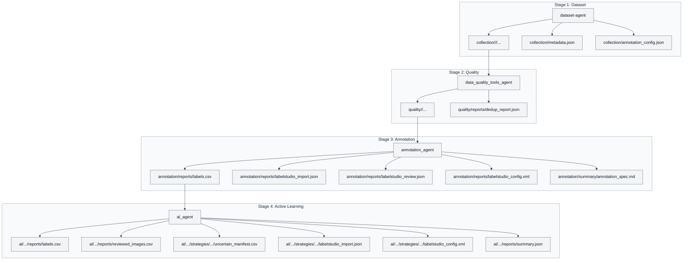
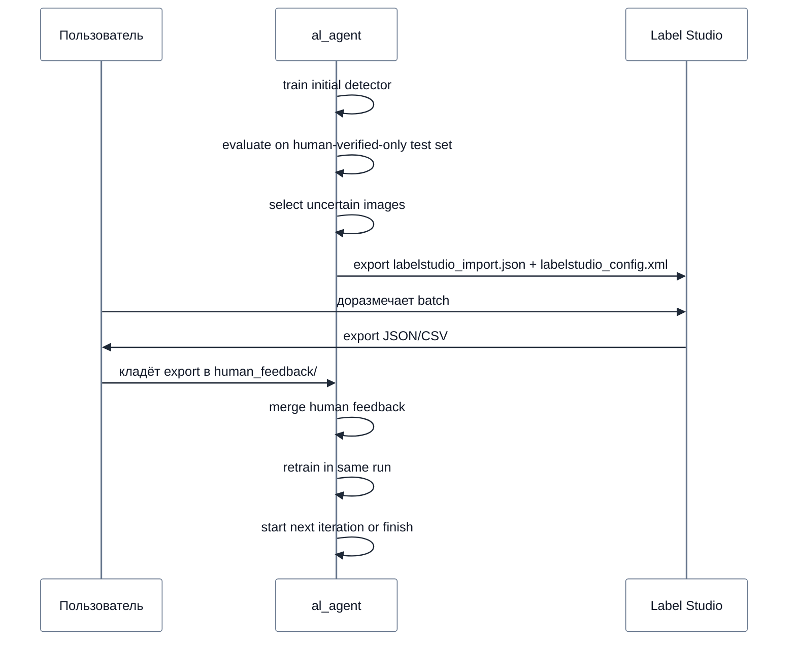
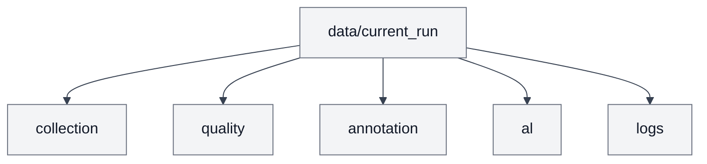

# Визуализация работы системы

Главный orchestration entrypoint:
- [testing_pipeline.py](/home/agar1us/Data_for_ML/testing_pipeline.py)

Основные агенты:
- [dataset-agent](/home/agar1us/Data_for_ML/dataset-agent)
- [data_quality_tools_agent](/home/agar1us/Data_for_ML/data_quality_tools_agent)
- [annotation_agent](/home/agar1us/Data_for_ML/annotation_agent)
- [al_agent](/home/agar1us/Data_for_ML/al_agent)

## 1. Общая схема системы

```mermaid
%%{init: {"theme":"base","themeVariables":{"background":"#ffffff","primaryColor":"#f3f4f6","primaryTextColor":"#111827","primaryBorderColor":"#6b7280","lineColor":"#374151","secondaryColor":"#e0f2fe","secondaryTextColor":"#0f172a","secondaryBorderColor":"#0284c7","tertiaryColor":"#ecfccb","tertiaryTextColor":"#1f2937","tertiaryBorderColor":"#65a30d","clusterBkg":"#f8fafc","clusterBorder":"#94a3b8","actorBkg":"#ffffff","actorBorder":"#64748b","actorTextColor":"#111827","noteBkgColor":"#fff7ed","noteBorderColor":"#fb923c","noteTextColor":"#111827","signalColor":"#1f2937","edgeLabelBackground":"#ffffff"}}}%%
flowchart LR
    U[Пользовательский запрос] --> P[testing_pipeline.py]

    P --> D[dataset-agent]

    D --> Q[data_quality_tools_agent]

    Q --> A[annotation_agent]

    A --> AL[al_agent]

    AL --> LS[Label Studio]
    LS --> HF[Human feedback export]
    HF --> AL
```

## 2. Поток артефактов по стадиям

## 3. Основные инструменты `dataset-agent`

```mermaid
%%{init: {"theme":"base","themeVariables":{"background":"#ffffff","primaryColor":"#f3f4f6","primaryTextColor":"#111827","primaryBorderColor":"#6b7280","lineColor":"#374151","secondaryColor":"#e0f2fe","secondaryTextColor":"#0f172a","secondaryBorderColor":"#0284c7","tertiaryColor":"#ecfccb","tertiaryTextColor":"#1f2937","tertiaryBorderColor":"#65a30d","clusterBkg":"#f8fafc","clusterBorder":"#94a3b8","actorBkg":"#ffffff","actorBorder":"#64748b","actorTextColor":"#111827","noteBkgColor":"#fff7ed","noteBorderColor":"#fb923c","noteTextColor":"#111827","signalColor":"#1f2937","edgeLabelBackground":"#ffffff"}}}%%
flowchart TD
    D[dataset-agent orchestrator]
    IA[image_agent]
    SA[search_agent]
    PA[parser_agent]
    I1[search_and_download_images]
    I2[save_metadata]
    S1[DuckDuckGoSearchTool]
    S2[VisitWebpageTool]
    S3[search_huggingface / download_hf_dataset]
    S4[search_kaggle / download_kaggle_dataset]
    P1[fetch_page]
    P2[extract_table_from_html]
    P3[extract_links_from_page]
    P4[download_file]
    P5[save_dataset / save_metadata]
    P6[write_text_artifact]

    D --> IA
    D --> SA
    D --> PA

    IA --> I1
    IA --> I2

    SA --> S1
    SA --> S2
    SA --> S3
    SA --> S4

    PA --> P1
    PA --> P2
    PA --> P3
    PA --> P4
    PA --> P5
    PA --> P6
```

## 4. Основные инструменты `quality-agent`

```mermaid
%%{init: {"theme":"base","themeVariables":{"background":"#ffffff","primaryColor":"#f3f4f6","primaryTextColor":"#111827","primaryBorderColor":"#6b7280","lineColor":"#374151","secondaryColor":"#e0f2fe","secondaryTextColor":"#0f172a","secondaryBorderColor":"#0284c7","tertiaryColor":"#ecfccb","tertiaryTextColor":"#1f2937","tertiaryBorderColor":"#65a30d","clusterBkg":"#f8fafc","clusterBorder":"#94a3b8","actorBkg":"#ffffff","actorBorder":"#64748b","actorTextColor":"#111827","noteBkgColor":"#fff7ed","noteBorderColor":"#fb923c","noteTextColor":"#111827","signalColor":"#1f2937","edgeLabelBackground":"#ffffff"}}}%%
flowchart TD
    QA[data_quality_tools_agent]

    subgraph IMG[Image dataset path]
        QT1[prepare_run_dir]
        QT2[deduplicate_image_dataset]
    end

    subgraph TAB[Tabular audit path]
        QT3[validate_and_load_table]
        QT4[profile_table]
        QT5[suggest_dtypes]
        QT6[compute_correlations]
        QT7[detect_all_issues]
        QT8[apply_cleaning_plan]
        QT9[compare_before_after]
        QT10[select_best_strategy]
        QT11[plot_quality_dashboard]
        QT12[plot_distributions]
        QT13[render_quality_notebook]
    end

    QA --> QT1
    QA --> QT2
    QA --> QT3
    QA --> QT4
    QA --> QT5
    QA --> QT6
    QA --> QT7
    QA --> QT8
    QA --> QT9
    QA --> QT10
    QA --> QT11
    QA --> QT12
    QA --> QT13
```

## 5. Основные инструменты `annotation-agent`

```mermaid
%%{init: {"theme":"base","themeVariables":{"background":"#ffffff","primaryColor":"#f3f4f6","primaryTextColor":"#111827","primaryBorderColor":"#6b7280","lineColor":"#374151","secondaryColor":"#e0f2fe","secondaryTextColor":"#0f172a","secondaryBorderColor":"#0284c7","tertiaryColor":"#ecfccb","tertiaryTextColor":"#1f2937","tertiaryBorderColor":"#65a30d","clusterBkg":"#f8fafc","clusterBorder":"#94a3b8","actorBkg":"#ffffff","actorBorder":"#64748b","actorTextColor":"#111827","noteBkgColor":"#fff7ed","noteBorderColor":"#fb923c","noteTextColor":"#111827","signalColor":"#1f2937","edgeLabelBackground":"#ffffff"}}}%%
flowchart TD
    AA[annotation_agent]
    AT1[inspect_image_dataset_impl]
    AT2[run_yoloe_labeling_impl]
    AT3[compute_annotation_quality_impl]
    AT4[build_object_labels_impl]
    AT5[export_labelstudio_predictions_impl]
    AT6[summarize_annotation_examples_impl]
    AT7[generate_annotation_spec / generate_spec_with_agent]
    AT8[convert_labelstudio_export_to_object_labels_impl]

    AA --> AT1
    AA --> AT2
    AA --> AT3
    AA --> AT4
    AA --> AT5
    AA --> AT6
    AA --> AT7
    AA --> AT8
```

## 6. Основные инструменты `al-agent`

```mermaid
%%{init: {"theme":"base","themeVariables":{"background":"#ffffff","primaryColor":"#f3f4f6","primaryTextColor":"#111827","primaryBorderColor":"#6b7280","lineColor":"#374151","secondaryColor":"#e0f2fe","secondaryTextColor":"#0f172a","secondaryBorderColor":"#0284c7","tertiaryColor":"#ecfccb","tertiaryTextColor":"#1f2937","tertiaryBorderColor":"#65a30d","clusterBkg":"#f8fafc","clusterBorder":"#94a3b8","actorBkg":"#ffffff","actorBorder":"#64748b","actorTextColor":"#111827","noteBkgColor":"#fff7ed","noteBorderColor":"#fb923c","noteTextColor":"#111827","signalColor":"#1f2937","edgeLabelBackground":"#ffffff"}}}%%
flowchart TD
    ALA[al_agent]
    LT1[image_detection_active_learning]
    LT2[build_image_inventory]
    LT3[prepare_detection_splits]
    LT4[select_human_test_candidates]
    LT5[export_labelstudio_detection_batch]
    LT6[wait_for_human_export]
    LT7[merge_human_feedback]
    LT8[YOLODetectionBackend.train]
    LT9[YOLODetectionBackend.predict]
    LT10[evaluate_detection_metrics]
    LT11[select_uncertain_images]

    ALA --> LT1
    LT1 --> LT2
    LT1 --> LT3
    LT1 --> LT4
    LT1 --> LT5
    LT1 --> LT6
    LT1 --> LT7
    LT1 --> LT8
    LT1 --> LT9
    LT1 --> LT10
    LT1 --> LT11
```

## 7. Внутренний цикл active learning

## 8. Что делает каждый агент

### `dataset-agent`
- Собирает raw image dataset.
- Нормализует layout collection stage.
- Пишет `metadata.json`.
- Пишет `annotation_config.json` с generic `object_prompts`.

### `quality-agent`
- Чистит собранные данные.
- Выполняет deduplication.
- Сохраняет cleaned dataset прямо в `quality/<class>/...`.

### `annotation-agent`
- Запускает авторазметку bbox.
- Геометрию берёт из detector output.
- Semantic class берёт из папки.
- Готовит импорт и review export для Label Studio.

### `al-agent`
- Берёт bbox-level `labels.csv`.
- Строит `human-verified-only` test protocol.
- Выбирает uncertain batch.
- Ждёт human feedback.
- Мержит разметку и переобучает модель в том же процессе.

## 9. Корневая папка артефактов

## 10. Что важно помнить

- Pipeline сейчас состоит из 4 стадий: `dataset -> quality -> annotation -> al`
- Канонический training handoff в downstream - это bbox-level `labels.csv`
- `al-agent` не должен использовать auto-labeled fallback test set
- Для Label Studio локальные пути должны быть относительны `LABEL_STUDIO_LOCAL_FILES_DOCUMENT_ROOT`
